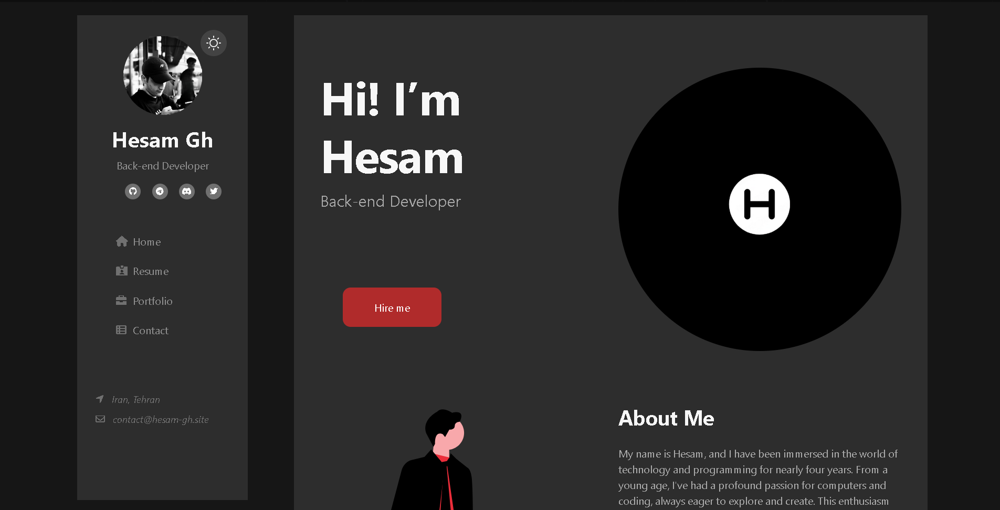

<h1 align="center">
    
     
    My Personal Website - Portfolio
</h1>

    

<h3 align="center">
    Personal website built with ReactJS, featuring a user interface designed for a smooth user experience.
</h3>

## 🚨 Forking this repo (please read!)

Many people have contacted me asking if they can use this code for their own website, and the answer to that question is usually **yes, with attribution**.

## Live Demo [Watch](https://hesam-gh.site)

<h2>⚠️ License & 📝 Credits</h2>

    Hesam's Portfolio is an open-source project licensed under the MIT License. Created by <a href="https://github.com/its-hesam">@its-hesam</a>.

